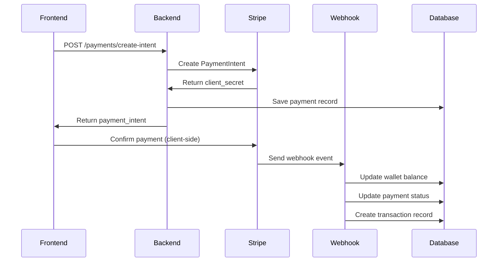

# 🚀 Backend Payment Integration Setup Guide

## 📋 **What We've Built**

### ✅ **Complete Stripe Payment System**
- **Payment Intent API** - Create payments for wallet top-ups
- **Payment Methods API** - Save and manage customer payment methods
- **Webhook Handler** - Process payment confirmations automatically
- **Database Integration** - Full payment tracking and history
- **Security** - Row-level security and proper authentication

### 🔧 **New API Endpoints**

```
POST /api/payments/create-intent     # Create payment intent
GET  /api/payments/methods           # List saved payment methods
POST /api/payments/methods/{id}/set-default  # Set default payment method
DELETE /api/payments/methods/{id}    # Delete payment method
POST /api/payments/webhook           # Stripe webhook handler
```

## 🛠️ **Setup Instructions**

### **Step 1: Install Dependencies**
```bash
cd backend
pip install -r requirements.txt
```

### **Step 2: Database Migration**
```bash
# Apply the payment system migration
supabase db push
```

### **Step 3: Stripe Account Setup**

1. **Create Stripe Account**: Go to [stripe.com](https://stripe.com) and create account
2. **Get API Keys**: 
   - Go to Developers → API keys
   - Copy `Publishable key` and `Secret key`
3. **Set up Webhooks**:
   - Go to Developers → Webhooks
   - Add endpoint: `https://your-backend-url.com/api/payments/webhook`
   - Select events: `payment_intent.succeeded`, `payment_intent.payment_failed`
   - Copy webhook secret

### **Step 4: Environment Configuration**

Create `backend/.env` from `backend/env.example`:

```bash
# Required Stripe Configuration
STRIPE_SECRET_KEY=sk_test_your_actual_secret_key_here
STRIPE_PUBLISHABLE_KEY=pk_test_your_actual_publishable_key_here
STRIPE_WEBHOOK_SECRET=whsec_your_actual_webhook_secret_here

# Your existing Supabase config
SUPABASE_URL=https://your-project.supabase.co
SUPABASE_SERVICE_ROLE_KEY=your-service-role-key
```

### **Step 5: Test the Integration**

1. **Start Backend**:
```bash
cd backend
uvicorn main:app --reload --port 8000
```

2. **Test Payment Creation**:
```bash
curl -X POST "http://localhost:8000/api/payments/create-intent" \
  -H "Authorization: Bearer your-jwt-token" \
  -H "Content-Type: application/json" \
  -d '{
    "organization_id": "your-org-id",
    "amount": 100.00
  }'
```

3. **Check Database**:
```sql
-- Check if payment was created
SELECT * FROM payments ORDER BY created_at DESC LIMIT 5;

-- Check if organization has Stripe customer ID
SELECT id, name, stripe_customer_id FROM organizations;
```

## 🔄 **How Payment Flow Works**

### **Frontend → Backend → Stripe → Webhook → Database**



## 🧪 **Testing Scenarios**

### **Test 1: Successful Payment**
```javascript
// Frontend test (you'll implement this next)
const response = await fetch('/api/payments/create-intent', {
  method: 'POST',
  headers: {
    'Authorization': `Bearer ${token}`,
    'Content-Type': 'application/json'
  },
  body: JSON.stringify({
    organization_id: 'org-123',
    amount: 50.00
  })
});

const { client_secret } = await response.json();
// Use client_secret with Stripe Elements
```

### **Test 2: Webhook Processing**
```bash
# Use Stripe CLI to test webhooks locally
stripe listen --forward-to localhost:8000/api/payments/webhook
stripe trigger payment_intent.succeeded
```

### **Test 3: Payment Methods**
```bash
# List payment methods
curl -X GET "http://localhost:8000/api/payments/methods?organization_id=org-123" \
  -H "Authorization: Bearer your-jwt-token"
```

## 🔧 **Database Schema**

### **New Tables Created**:

1. **`payments`** - Tracks all payment attempts
2. **`payment_methods`** - Stores saved payment methods
3. **`organizations.stripe_customer_id`** - Links org to Stripe customer

### **Key Features**:
- **Row Level Security** - Users can only see their org's data
- **Automatic Triggers** - Ensure data consistency
- **Payment Statistics View** - Analytics ready

## 🚀 **Next Steps**

### **Phase 1 Complete ✅**
- [x] Stripe Payment API
- [x] Database schema
- [x] Webhook processing
- [x] Security policies

### **Phase 2: Frontend Integration**
- [ ] Add Stripe Elements to frontend
- [ ] Payment form components
- [ ] Wallet top-up UI
- [ ] Payment method management

### **Phase 3: Telegram Bot Integration**
- [ ] Payment commands in bot
- [ ] Payment links for Telegram
- [ ] Balance notifications

### **Phase 4: Production Deployment**
- [ ] Switch to live Stripe keys
- [ ] Set up production webhooks
- [ ] Monitor payment processing

## 🔍 **Troubleshooting**

### **Common Issues**:

1. **Webhook not receiving events**:
   - Check webhook URL is publicly accessible
   - Verify webhook secret matches
   - Check Stripe dashboard for delivery attempts

2. **Payment creation fails**:
   - Verify Stripe API keys are correct
   - Check organization exists in database
   - Ensure user has permission for organization

3. **Database errors**:
   - Run migration: `supabase db push`
   - Check RLS policies are applied
   - Verify foreign key relationships

### **Debug Commands**:
```sql
-- Check payment processing
SELECT p.*, o.name as org_name 
FROM payments p 
JOIN organizations o ON p.organization_id = o.id 
ORDER BY p.created_at DESC;

-- Check webhook events
SELECT * FROM payments WHERE stripe_payment_intent_id IS NOT NULL;

-- Check wallet balances
SELECT id, name, wallet_balance FROM organizations;
```

## 💡 **Production Considerations**

### **Security**:
- Never expose secret keys in frontend
- Use HTTPS for all webhook endpoints
- Implement proper rate limiting
- Monitor for suspicious activity

### **Monitoring**:
- Set up alerts for failed payments
- Monitor webhook delivery success rates
- Track payment conversion rates
- Log all payment-related errors

### **Compliance**:
- Store minimal payment data
- Implement data retention policies
- Ensure PCI compliance for card data
- Set up audit logging

---

## 🎉 **Ready for Integration!**

Your backend now has a **production-ready payment system**! 

**What works right now**:
- ✅ Create payment intents
- ✅ Process successful payments via webhooks
- ✅ Update wallet balances automatically
- ✅ Track payment history
- ✅ Manage payment methods
- ✅ Full security and permissions

**Next**: Integrate with frontend and Telegram bot to complete the payment flow! 